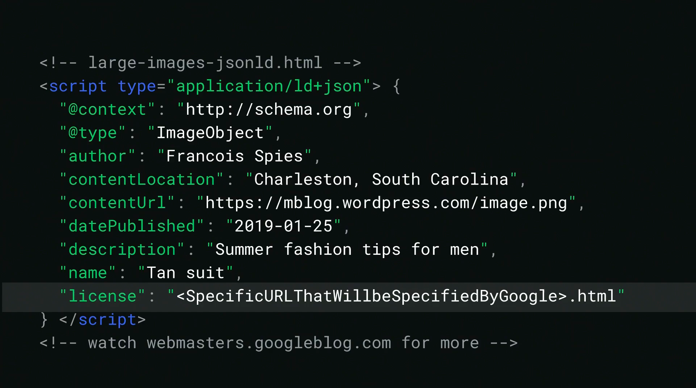

Lots of new stuff announced for SEO announced this year at I/O ranging from Structured Data, Website Performance and User Experience. So let's just jump into it.

### Googlebot now crawls Javascript sites 🎉

The Googlebot (which crawls all your webpages for content) will use the **latest Chromium** rendering engine. If you, like me, had reservations for using javascript frameworks like [Gatsby.js](https://www.gatsbyjs.org/) or [Gridsome](https://gridsome.org/) in fear of bad SEO, now is the time to get on it. 

I tested some pages with heavy javascript using Gatsby.js which Google indexed perfectly. And the bot will also regularly update its rendering engine to match the latest Chromium.

  
See the announcement video

  

### Speed report on Search Console 📊

Do you ever wanted to cry looking at the speed of your site? Now you can! Sign up for beta testing [here](https://docs.google.com/forms/d/e/1FAIpQLSfCpmZbF7t0lZbyXuc6rsB8CiB3ySifqe4Vn-58A9pCbFTGfw/viewform)

### New Structured Data, FAQ and How-to 🆕

Why doesn't Google call it a Schema? Anyway they now support two new "Structured Data", FAQ and How-to

**FAQ**: An FAQ page provides a list of frequently asked questions and answers on a particular topic.

**How-to**: How-to rich results provide users with richer previews of web results that guide users through step-by-step tasks.

  
View Images of these Structured Data

  
  
  
  

### High Resolution Image Opt-in Program 🌃

You can give our overlord Google even higher quality images.

### More Stuff 👏👏

You can see your webpage performance on search results itself when you search for it.

---

Swipe up to navigate to your AMP supported webpage in image search results. Although the UI looks a little weird.

---

New `font-display` for faster Google font loading



---

See the full state of the union here:



---

### That's all bye